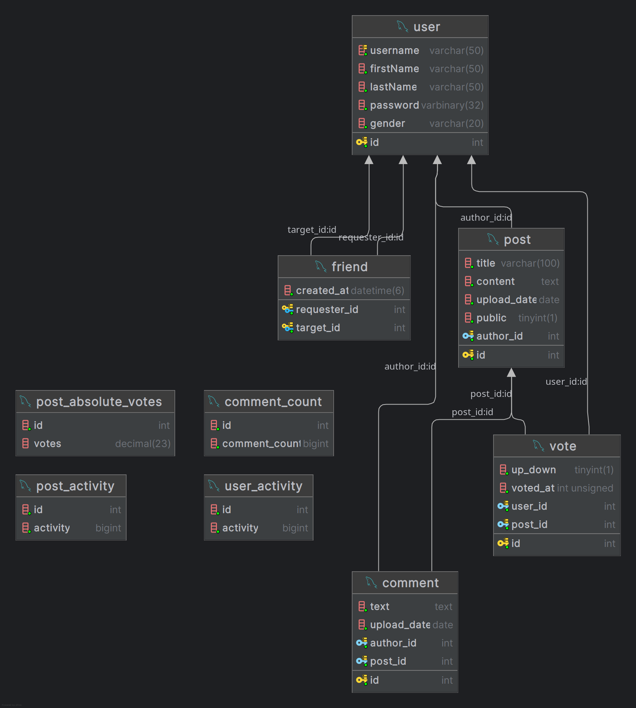
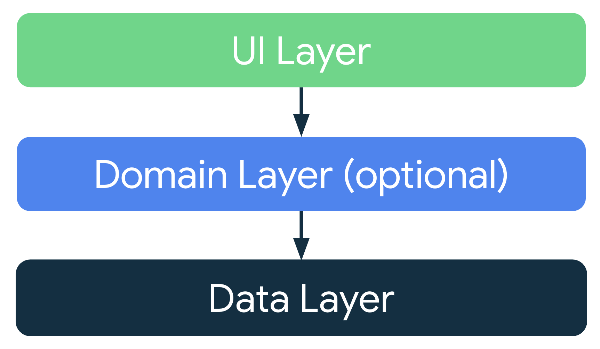

**This project was made as a school assignment and has no real purpose!**

**School:** Střední Průmyslová Škola Elektrotechnická Ječná  
**Author:** Tomáš Hůla (tomashula06@gmail.com)  
**Date of elaboration:** 16.01.2025

# OpiNet developer documentation

First read user documentation (README): [README.md](README.md)

## Client Requirements

All requirements can be found at: https://moodle.spsejecna.cz/mod/page/view.php?id=6889

## Database structure

Database diagram:

Where `post_absolute_votes`, `comment_count`, `post_activity` and `user_activity` are views, the rest are tables.

## Overall development info

The app is built using [Kotlin language](https://kotlinlang.org/) which is in this case compiled to JVM bytecode and thus this application is runnable on the Java JVM.
The UI framework is [Compose Multiplatform](https://www.jetbrains.com/compose-multiplatform/), specifically [desktop](https://github.com/JetBrains/compose-multiplatform?tab=readme-ov-file#desktop).
The whole project is built and managed using [Gradle](https://gradle.org/).

## Application architecture and structure

The application follows the MVVM (Model-View-Viewmodel) architecture.

Each screen in the application consists of its model, (service) view (screen) and viewmodel (screenmodel)
Each logical entity has its directory, which contains data access logic.
Each application screen has its directory (suffix `screen`), which contains the screen's view and viewmodel logic.

## Third-party libraries

Can be found in the `gradle/libs.verstions.toml` file.
All libraries are managed by Gradle.

## Setting up development environment

1. Java 21 or newer is required for both development and running of the application.
2. Clone the repository: `git clone https://github.com/Tomasan7/OpiNet.git`
3. IntelliJ IDEA is the recommended IDE for development.

### Building

Run `./gradlew build` (Linux) or `gradlew.bat build` (Windows) to build the project.

### Running

If using IntelliJ IDEA, just use normal Kotlin run configuration with the Main class `me.tomasan7.opinet.MainKt`.  
In general you can run the project with `./gradlew run` (Linux) or `gradlew.bat run` (Windows).

### Packaging

#### Platform specific JAR

A platform specific JAR, which only includes dependencies for the target platform can be built for the platform you are currently on.

Run `./gradlew packageReleaseUberJarForCurrentOS` (Linux) or `gradlew.bat packageReleaseUberJarForCurrentOS` (Windows) to build the JAR.

The JAR will be located at `build/compose/jars/OpiNet-<platform>-<arch>-<version>.jar`.

#### Universal JAR

A universal JAR, which includes all dependencies for all platforms can be built.

Run `./gradlew shadowJar` (Linux) or `gradlew.bat shadowJar` (Windows) to build the JAR.

The JAR will be located at `build/libs/OpiNet-universal-<version>-all.jar`.
